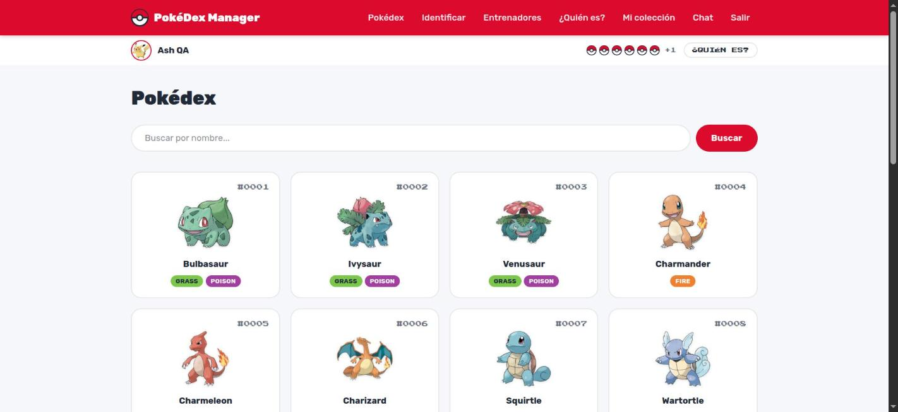

# PokéDex Manager

Aplicación full-stack para gestionar una colección personal de Pokémon, con capa de IA:
identificación de Pokémon por imagen (modelo multimodal) y un asistente conversacional
con tool calling sobre la colección del usuario.

**Demo en vivo:** https://209-50-54-47.sslip.io · **AI service:** https://api.209-50-54-47.sslip.io/docs

Instalable como **PWA** (Chrome/Edge: ícono de instalar en la barra de direcciones;
móvil: "Agregar a pantalla de inicio").

> **Cuenta demo** para probar la demo en vivo sin registrarse (la confirmación de
> email está activa a propósito, ver D8): `pokedex-qa-01@e2etest.dev` /
> `TestPass123!` — con equipo, avatar y medallero ya poblados.



## Stack

| Capa | Tecnología | Por qué |
|---|---|---|
| Frontend + app API | Next.js 16 (App Router, Server Components/Actions), TypeScript, Tailwind | Productividad y UI responsive con estado mínimo en el cliente |
| Auth + DB | Supabase (Auth + Postgres + **RLS**) | Auth production-grade sin construirla a mano; el aislamiento por usuario vive en la base de datos |
| Servicio de IA | Python 3.12 + FastAPI | Estándar del ecosistema de IA; Pydantic como contrato de salida |
| Datos Pokémon | [PokéAPI](https://pokeapi.co/) | Fuente de verdad externa; la DB solo guarda la relación usuario↔pokémon + snapshot |
| LLMs | Groq (qwen3.6 visión / llama-3.3 texto) → Gemini → Anthropic | Cadena con fallback; con una sola API key configurada funciona |

## Arquitectura

```
                    ┌─────────────────────────────┐
                    │        NAVEGADOR             │
                    └──────┬──────────────┬───────┘
                           │              │
                    (páginas, auth)   (upload img, chat)
                           │              │
                ┌──────────▼─────┐  ┌─────▼──────────────┐
                │  WEB (Next.js) │  │ AI-SERVICE (FastAPI)│
                │  - Auth UI     │  │  POST /identify     │
                │  - /pokedex    │  │  POST /agent        │
                │  - /collection │  │  (sin service key)  │
                └───┬───────┬────┘  └──┬───────────┬──────┘
                    │       │          │           │
              JWT usuario   │     JWT usuario   cadena LLM
                    │       │          │           │
             ┌──────▼───────▼──┐   ┌──▼────┐  ┌────▼─────────────┐
             │    SUPABASE     │   │PokéAPI│  │ Groq → Gemini →  │
             │  Auth + Postgres│   │       │  │ Anthropic        │
             │  RLS por user   │   │       │  │ (fallback chain) │
             └─────────────────┘   └───────┘  └──────────────────┘
```

**Principios que gobiernan el diseño** (detalle en `docs/DECISIONS.md`):

1. **RLS es la seguridad, no el código de app.** Todo acceso a la colección viaja con el
   JWT del usuario. El ai-service *no tiene* service key a propósito: aunque tuviera un
   bug o el LLM pidiera algo indebido, Postgres impide tocar filas ajenas.
2. **El LLM nunca toca la DB ni decide datos críticos.** Propone herramientas; código
   determinista las ejecuta. Los errores de tools regresan al modelo, nunca se ocultan.
3. **Outputs del modelo siempre validados**: Pydantic + verificación anti-alucinación
   contra PokéAPI — si el modelo "identifica" un Pokémon que no existe, `found: false`.

## Correrlo localmente

Requisitos: Docker + un proyecto de Supabase (gratis) + una API key de Groq (gratis).

```bash
git clone <este-repo> && cd pokedex-manager

# 1. Supabase: crear proyecto nuevo → SQL Editor → pegar y correr supabase/schema.sql

# 2. Variables de entorno (ver tabla abajo)
cp web/.env.example web/.env.local        # llenar
cp ai-service/.env.example ai-service/.env # llenar

# 3. Todo junto
docker compose up --build
# web:      http://localhost:3000
# ai-service: http://localhost:8000 (Swagger en /docs)
```

Modo desarrollo sin Docker:

```bash
cd web && npm install && npm run dev                          # :3000
cd ai-service && pip install -r requirements.txt \
  && set -a && source .env && set +a \
  && uvicorn app.main:app --reload                            # :8000
python evals/run_evals.py                                     # evals (ai-service corriendo)
```

### Variables de entorno

| Archivo | Variable | Qué es |
|---|---|---|
| `web/.env.local` | `NEXT_PUBLIC_SUPABASE_URL` | URL del proyecto Supabase |
| | `NEXT_PUBLIC_SUPABASE_ANON_KEY` | Anon key (pública por diseño; la seguridad es RLS) |
| | `NEXT_PUBLIC_AI_SERVICE_URL` | URL del ai-service que llama el navegador |
| `ai-service/.env` | `GROQ_API_KEY` | Con una basta; la cadena salta providers sin key |
| | `GEMINI_API_KEY`, `ANTHROPIC_API_KEY` | Opcionales (fallback) |
| | `CORS_ORIGINS` | Orígenes permitidos, separados por coma |
| | `SUPABASE_URL`, `SUPABASE_ANON_KEY` | Mismo proyecto que la web |

> Nota: las `NEXT_PUBLIC_*` se inlinean en build time — `web/.env.local` debe existir
> **antes** de `docker compose build`.

> **Confirmación de email activa** (decisión D8): una cuenta nueva no puede iniciar
> sesión hasta confirmar el correo. Usar un correo real o alias `+tag@gmail.com`.

> **Login con Google es opcional**: el botón existe, pero en una instancia propia
> requiere habilitar el provider Google en Supabase (Auth → Providers) con un
> OAuth client de Google Cloud. Sin esa config, el login con correo funciona
> normal y el botón solo mostrará un error si se usa.

## Cómo usarla (guía rápida)

1. **Entra** con la cuenta demo de arriba (o regístrate — llega correo de confirmación).
   Al primer login te recibe un **tour guiado** de 9 pasos por todas las funciones.
2. **Explora la Pokédex** y abre cualquier Pokémon: sprite animado, su grito,
   movimientos (tócalos para ver poder/precisión/PP) y flechas ◀ ▶ para navegar.
3. **Captura** con el botón de la ficha — confetti y directo a tu colección.
4. **Tu colección** (`Mi colección`): ponle nombre y foto a tu entrenador (galería o
   cámara), gana medallas por logros y gestiona tu equipo (notas, soltar).
5. **Identifica por imagen** (`Identificar`): sube una foto o usa el Modo Pokédex con
   la cámara del dispositivo; captura en un clic lo que la IA reconozca.
6. **Chatea** (`Chat`): pídele análisis, comparativas o recomendaciones sobre tu
   colección — responde con datos reales de sus herramientas, con cards visuales.
7. **Comunidad** (`Entrenadores`): mira los equipos y medalleros públicos de otros;
   y juega **¿Quién es ese Pokémon?** para probar tu memoria.

**Problemas comunes:** el correo de confirmación puede caer en spam · la primera
llamada a `/identify` o `/chat` puede tardar unos segundos (cold start del provider
LLM) · el botón de Google en una instancia propia requiere configurar el provider
(nota abajo).

## Funcionalidades

**Core**
- Registro / login / logout (Supabase Auth, Server Actions; **toda la app
  requiere sesión** — sin ella solo login/registro son visibles y accesibles) +
  **login con Google** (OAuth PKCE, callback propio; el perfil público se crea
  solo en el primer login — ver D14)
- `/pokedex` — lista paginada con **búsqueda en tiempo real** (typeahead con
  sprites), **filtro por generación** (I–IX, por rangos de id — cero fetches
  extra), contador de progreso (capturados / existentes), pokébola en las cards
  que ya son tuyas, toggle "mis capturados", tipos coloreados y banner del
  entrenador
- `/pokedex/[name]` — detalle con sprite **animado**, grito (audio), barras de stats,
  **movimientos como botones** (tocar = tipo/poder/precisión/PP desde PokéAPI) y
  flechas anterior/siguiente
- `/collection` — perfil de entrenador (nombre + foto desde galería o cámara,
  **medallero** de 8 medallas por logros) y listado del equipo **estilo Game Boy**
  (sprites pixelados, barra de PS); soltar, editar nota; **solo tuya** (RLS)
- Capturar dispara **confetti**, scroll a la ficha, brinco de felicidad del
  sprite, su grito y un toast "¡GOTCHA!" con acceso a la colección
- `/trainers` — comunidad: directorio público de entrenadores y perfil de cada uno
  (foto, medallero y equipo — las notas personales siguen privadas, ver D12)
- `/quien-es` — juego "¿Quién es ese Pokémon?" como en la serie (silueta + racha)
- **PWA instalable** con tab bar inferior tipo app en mobile (botón central = cámara)
  y banner de sugerencia de instalación
- **Tour de bienvenida** para usuarios nuevos: 9 pasos que recorren todas las
  funcionalidades con acceso directo a cada una (se muestra una sola vez)
- Responsive mobile-first

**Bonus 1 — Identificación por imagen (LMM)**
- `/identify` — sube una foto o usa el **Modo Pokédex**: cámara del dispositivo con
  visor y obturador, como una Pokédex real → el modelo de visión identifica →
  verificación contra PokéAPI → capturar en un clic
- Parseo defensivo del output del modelo (fences markdown, bloques `<think>` de modelos
  razonadores, extracción de JSON balanceado)

**Bonus 2 — Servidor MCP (Model Context Protocol)**
- `ai-service/mcp_server.py` — servidor MCP sobre **stdio** (SDK oficial de Python)
  que conecta la colección a cualquier cliente MCP (Claude Desktop, Claude Code)
  usando los **tres primitivos** del protocolo:
  - **6 tools** — gestión completa: `query_collection`, `search_pokeapi`,
    `add_pokemon`, `remove_pokemon`, `update_note`, `trainer_directory`
  - **1 resource** — la colección como JSON de solo lectura (`collection://mine`)
  - **2 prompts** — en Claude Code aparecen como slash commands:
    `/mcp__pokedex__analizar_coleccion` y `/mcp__pokedex__capturar`
- Cero lógica duplicada: las implementaciones deterministas viven una sola vez en
  `app/agent.py` (registry compartido); el agente de `/chat` expone un subconjunto
  y el MCP la gestión completa
- Misma postura de seguridad que todo el sistema: el servidor se autentica como un
  **usuario real** (login contra Supabase Auth, JWT cacheado con renovación y retry
  en 401) — RLS decide qué ve, sin service key
- **Configurarlo (2 pasos):**

  ```bash
  # 1. Dependencias (una vez; el compose no crea este venv local)
  cd ai-service && python3 -m venv .venv && .venv/bin/pip install -r requirements.txt

  # 2. Registrarlo en Claude Code — las credenciales de Supabase se leen
  #    solas de ai-service/.env (ya llenado para el servicio)
  claude mcp add pokedex \
    -e POKEDEX_EMAIL=pokedex-qa-01@e2etest.dev -e POKEDEX_PASSWORD='TestPass123!' \
    -- "$PWD/.venv/bin/python" "$PWD/mcp_server.py"
  ```

  Verificar: `claude mcp list` debe mostrar `pokedex ✔ Connected` (o `/mcp`
  dentro de una sesión). En **Claude Desktop** es el mismo comando y env en
  `claude_desktop_config.json`:
  ```json
  { "mcpServers": { "pokedex": {
      "command": "<repo>/ai-service/.venv/bin/python",
      "args": ["<repo>/ai-service/mcp_server.py"],
      "env": { "POKEDEX_EMAIL": "pokedex-qa-01@e2etest.dev",
               "POKEDEX_PASSWORD": "TestPass123!" } } } }
  ```

- **Usarlo** (sesión nueva de Claude Code, lenguaje natural):
  - *"¿Qué Pokémon hay en mi colección?"* · *"Busca a snorlax y agrégalo"* ·
    *"Ponle la nota 'mi favorito' a pikachu"* · *"Suelta a ditto"* ·
    *"¿Quiénes son los otros entrenadores?"*
  - O directo con los slash commands: `/mcp__pokedex__analizar_coleccion` y
    `/mcp__pokedex__capturar` (pide el nombre)
  - Cada llamada viaja con el JWT de la cuenta configurada — RLS aplica igual
    que en la web; lo que agregues aquí aparece en https://209-50-54-47.sslip.io
- Distinción honesta: el agente de `/chat` usa function calling estilo OpenAI
  (loop a mano, ver D3); este servidor habla el **protocolo MCP** real. Son dos
  mecanismos distintos y el repo demuestra ambos (ver D13)

**Bonus 3 — Asistente con tool calling y análisis de la colección**
- `/chat` — agente conversacional con 3 herramientas: `query_collection`,
  `search_pokeapi`, `add_pokemon`. Loop de tool calling escrito a mano (~100 líneas,
  sin frameworks — ver D3), traza de tools visible en la UI, historial persistente
  (tabla `chat_messages` con RLS) y cards visuales de Pokémon dentro de la conversación
- Cubre (parcialmente) el análisis inteligente del bonus 3: responde preguntas
  analíticas sobre TU colección con datos reales ("¿cuál de los míos tiene más
  ataque?"), comparativas entre Pokémon y sugerencias — siempre vía tools, nunca
  inventando datos
- **Sugerencias contextuales según tu equipo**: chips generados de tu colección
  real ("¿qué complementaría a [tu más fuerte]?", comparativas entre los tuyos),
  siempre a la mano sobre el input
- Resiliencia ante fallas del provider: el 400 `tool_use_failed` estocástico de
  Groq se reintenta y degrada a texto en vez de romper el chat (bug real de
  producción, cazado y documentado en D15)
- Las tools llaman a Supabase con el JWT del usuario → RLS aplica también dentro del agente

## QA

Todo lo anterior está verificado contra el deploy de producción con dos pases de
hard testing en browser real (21 checks el último: flujos completos de captura,
chat con tools, comunidad, juego, OAuth, RLS anónimo, MCP con cliente real) —
matriz completa y quirks conocidos en [`docs/QA-TESTING.md`](docs/QA-TESTING.md).

## Evals

Un agente sin evals es una demo. `evals/run_evals.py` corre 10 casos contra `/identify`
en 3 niveles de dificultad (artwork oficial, renders 3D, sprites pixelados de 96px) más
un control negativo. Resultado real (`evals/RESULTS.txt`):

```
PASS pikachu_artwork.png     esperado=pikachu     obtenido=pikachu     (conf=1.00)
PASS charizard_artwork.png   esperado=charizard   obtenido=charizard   (conf=1.00)
PASS bulbasaur_artwork.png   esperado=bulbasaur   obtenido=bulbasaur   (conf=1.00)
PASS gengar_artwork.png      esperado=gengar      obtenido=gengar      (conf=1.00)
PASS eevee_artwork.png       esperado=eevee       obtenido=eevee       (conf=1.00)
PASS squirtle_home.png       esperado=squirtle    obtenido=squirtle    (conf=1.00)
PASS snorlax_home.png        esperado=snorlax     obtenido=snorlax     (conf=1.00)
FAIL mewtwo_pixel.png        esperado=mewtwo      obtenido=meowth      (conf=0.95)
FAIL jigglypuff_pixel.png    esperado=jigglypuff  obtenido=clefairy    (conf=0.90)
PASS not_a_pokemon.png       esperado=None        obtenido=None        (conf=0.00)

8/10 casos correctos
```

**Limitación conocida y documentada a propósito:** sprites pixelados de 96px confunden
al modelo de visión (confidence alta y respuesta equivocada — el peor tipo de error).
Con imágenes normales (fotos, cartas, artwork) el desempeño es consistente. Mitigación
futura: upscaling previo o few-shot con ejemplos pixelados.

## Roadmap — siguiente iteración: guardería y crianza (D16)

Diseñada y documentada a propósito en vez de implementada a medias la víspera
de la entrega (el diseño completo vive en `docs/DECISIONS.md`, D16). Tres fases
incrementales que no rompen nada de lo existente:

1. **F5.1 — Sexo del Pokémon**: columna `gender` *nullable* en la colección;
   se sortea al capturar con el `gender_rate` real de PokéAPI. Filas históricas
   quedan "desconocido"; si el fetch falla, la captura continúa.
2. **F5.2 — Guardería (daycare)**: parejas compatibles por `egg_groups` de
   PokéAPI y sexos opuestos (regla Ditto incluida), tabla propia con el mismo
   patrón RLS, y huevos por **tiempo puro** (`egg_ready_at`) — sin crons ni
   workers.
3. **F5.3 — Híbridos generados por IA** ⭐: al cruzar especies distintas nace
   un Pokémon único. El LLM redacta un **prompt maestro** validado (Pydantic)
   con los rasgos reales de ambos padres y **Nano Banana (Gemini)** genera la
   imagen. Lo crítico sigue siendo determinista: stats = promedio de padres ±
   5%, nombre validado para NO existir en PokéAPI (anti-alucinación invertida),
   y los híbridos viven en tabla y bucket propios — nunca en `collection`:
   PokéAPI sigue siendo la única fuente de verdad de especies reales. Límite de
   1 eclosión/usuario/día para controlar el costo de generación.

El mismo principio que gobierna todo el repo, aplicado al caso más creativo:
**el LLM propone (describe, redacta); el código dispone (stats, validación,
persistencia).**

## Decisiones y trade-offs

Versión corta (completa en `docs/DECISIONS.md`, D1–D16):

- **Monorepo TS + Python** — cada lenguaje donde es más fuerte (D1)
- **Supabase con RLS** en vez de auth artesanal — la seguridad no depende de no
  equivocarse en cada endpoint (D2)
- **Tool calling a mano, sin LangChain** — para 3 herramientas, un framework agrega
  opacidad sin retorno; el loop explícito demuestra el mecanismo (D3)
- **Cadena de providers con fallback** — nunca un proveedor único; esta decisión se pagó
  sola cuando Groq retiró su modelo de visión a mitad del desarrollo (D4, D10)
- **Anti-alucinación**: el nombre que devuelve el modelo se verifica contra PokéAPI antes
  de aceptarse (D5)
- **ai-service sin service key** — un compromiso del servicio de IA no compromete datos
  de otros usuarios (D6)
- **Confirmación de email activa** — comportamiento production-grade sobre conveniencia
  de demo (D8)
- **Deploy en un VPS con el mismo docker-compose del repo** en vez de Vercel — evita
  partir la infra en dos y el problema de mixed content (frontend HTTPS llamando a un
  ai-service HTTP); el mismo `docker compose up` que corre el evaluador es el que corre
  producción. HTTPS con Caddy + sslip.io (certs automáticos de Let's Encrypt, sin
  comprar dominio) — ver `docker-compose.prod.yml` + `Caddyfile` (D11).
- **PWA instalable** — manifest + iconos generados de la pokébola SVG; requiere el
  HTTPS anterior (Chrome no ofrece instalación en contextos no seguros).
- **Capa social sin abrir la colección** — el directorio y los perfiles públicos de
  entrenadores exponen solo datos de exhibición vía funciones `security definer` con
  contrato mínimo; la tabla `collection` y las notas personales siguen tras RLS (D12).
- **Servidor MCP que reutiliza las tools del agente** — una sola implementación
  determinista por herramienta, dos mecanismos de exposición (function calling en
  `/chat`, protocolo MCP para clientes externos); autentica como usuario real,
  nunca con service key (D13).
- **`profiles` como identidad canónica del entrenador** — el login con Google
  sobreescribe `user_metadata` con la foto de Google en cada inicio de sesión,
  así que nombre/foto visibles salen siempre de `profiles` (app-owned) con
  metadata solo de fallback (D14).

## Estructura

```
web/                  Next.js — UI, auth, colección (Server Components/Actions)
ai-service/app/       FastAPI — main.py (/identify), agent.py (loop+tools), providers.py (cadena LLM)
ai-service/mcp_server.py  Servidor MCP stdio sobre la colección (bonus 2)
supabase/schema.sql   Tabla collection + políticas RLS (correr en SQL Editor)
evals/                Runner + imágenes + resultados
docs/                 ARCHITECTURE.md, DECISIONS.md (ADR-lite), PLAN.md, QA-TESTING.md
docker-compose.yml    Todo junto
```
